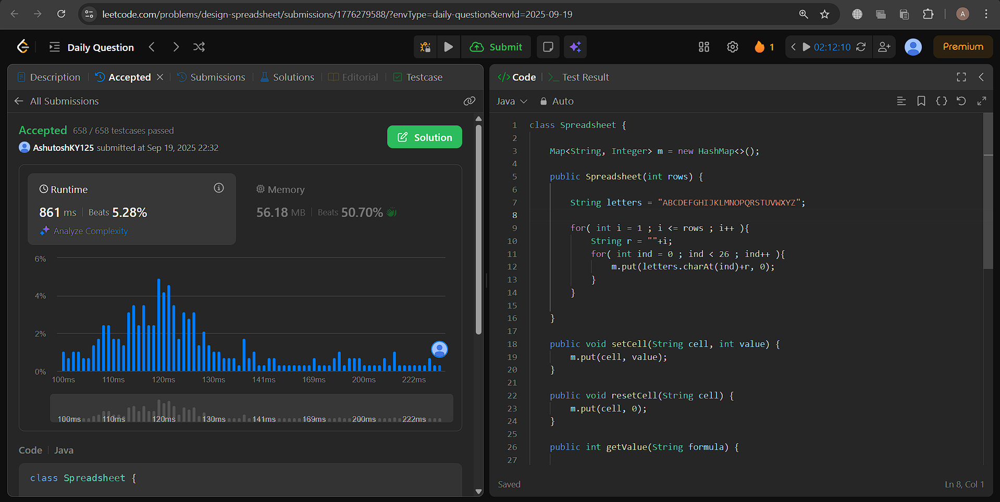
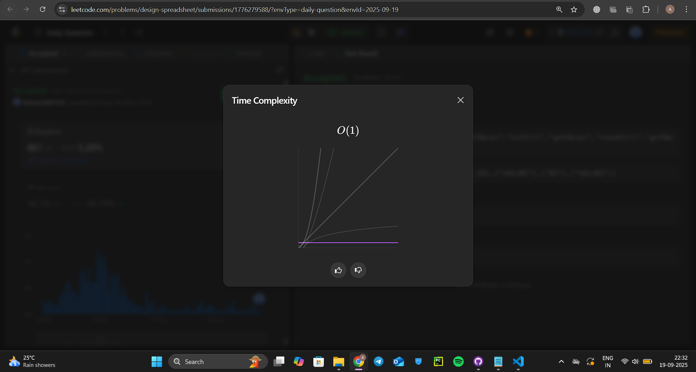
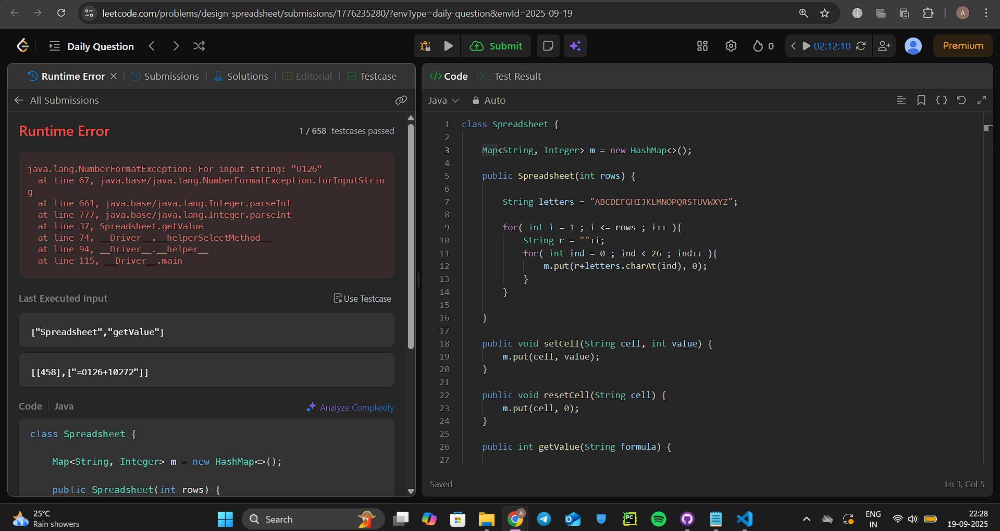

Day 2 – Design Spreadsheet (LeetCode POTD)
==========================================

\=====================================================

### Problem Link

LeetCode – [3484\. Design Spreadsheet](https://leetcode.com/problems/design-spreadsheet/submissions/1776279588/?envType=daily-question&envId=2025-09-19)

### My LeetCode Attempt




### My LeetCode Attempts

🧠 Iteration 1 – First Intuition
--------------------------------

**Intuition**My first idea was to directly simulate the spreadsheet as a **2D grid (rows × 26 columns)**, storing integers in a list of lists.

*   To map columns, I used letters (A, B, C … Z) with a manual hashmap.
    
*   Then, setCell and resetCell would simply update values in this 2D grid.
    
*   For formulas, I tried parsing the string and retrieving cell values.
  

**Code (1st attempt):**

```java
class Spreadsheet {

    List<List<Integer>> spread = new ArrayList<>();
    Map<String, Integer> m = new HashMap<>();

    public Spreadsheet(int rows) {
        List<Integer> row = new ArrayList<>();

        for( int i = 0 ; i < 26 ; i++){
            row.add(0);
        }
        for( int i = 0 ; i < rows ; i++ ){
            spread.add(row);
        }

        m.put( "A", 1);
        m.put( "B", 2);
        m.put( "C", 3);
        m.put( "D", 4);
        m.put( "E", 5);
        m.put( "F", 6);
        m.put( "G", 7);
        m.put( "H", 8);
        m.put( "I", 9);
        m.put( "J", 10);
        m.put( "K", 11);
        m.put( "L", 12);
        m.put( "M", 13);
        m.put( "N", 14);
        m.put( "O", 15);
        m.put( "P", 16);
        m.put( "Q", 17);
        m.put( "R", 18);
        m.put( "S", 19);
        m.put( "T", 20);
        m.put( "U", 21);
        m.put( "V", 22);
        m.put( "W", 23);
        m.put( "X", 24);
        m.put( "Y", 25);
        m.put( "Z", 26);

    }
    
    public void setCell(String cell, int value) {
        int row = m.get(cell.substring(0,1))-1;
        int col = cell.charAt(1) - '0' - 1;

        spread.get(row).add(col, value);

    }
    
    public void resetCell(String cell) {
        int row = m.get(cell.substring(0,1))-1;
        int col = cell.charAt(1) - '0' - 1;

        spread.get(row).add(col, 0);
    }
    
    public int getValue(String formula) {
        String a = 
        String b = formula.substring(4,6);
        if( formula.length() == 6)

        int arow = m.get(a.substring(0,1))-1;
        int acol = b.charAt(1) - '0' - 1;

        int brow = m.get(b.substring(0,1))-1;
        int bcol = b.charAt(1) - '0' - 1;

        return (spread.get(arow).get(acol)+spread.get(brow).get(bcol));
    }
}
```

**Mistakes / Learnings**

*   Manual column mapping was **too bulky** and not scalable.
    
*   I mistakenly reused the same row reference (row) → all rows were pointing to the same list.
    
*   Parsing formulas wasn’t handled well (unfinished logic).
    
*   Overall: The structure was **messy and error-prone**.
    

🧠 Iteration 2 – Cleaner Mapping with HashMap
---------------------------------------------

**Intuition**I realized I could simplify things by:

*   Using a **HashMap of cell → value** instead of a 2D grid.
    
*   Represent cells like "A1", "B2", etc. as keys in the map.
    
*   This way, setCell, resetCell, and getValue would just be simple hashmap lookups and updates.

 


**Code (2nd attempt):**


```java
class Spreadsheet {

    Map<String, Integer> m = new HashMap<>();

    public Spreadsheet(int rows) {

        String letters = "ABCDEFGHIJKLMNOPQRSTUVWXYZ";

        for( int i = 1 ; i <= rows ; i++ ){
            String r = ""+i;
            for( int ind = 0 ; ind < 26 ; ind++ ){
                m.put(r+letters.charAt(ind), 0);
            }
        }    
    }
    
    public void setCell(String cell, int value) {
        m.put(cell, value);
    }
    
    public void resetCell(String cell) {
        m.put(cell, 0);
    }
    
    public int getValue(String formula) {

        String c1 = formula.substring(1,formula.indexOf("+"));
        String c2 = formula.substring(formula.indexOf("+")+1, formula.length());

        int x = 0;
        int y = 0;

        if( m.containsKey(c1)){
            x = m.get(c1);
        }else{
            x = Integer.parseInt(c1);
        }

        if( m.containsKey(c2)){
            y = m.get(c2);
        }else{
            y = Integer.parseInt(c2);
        }

        return x+y;
    }
}
```

**Mistakes / Learnings**

*   This was **much cleaner** than before, but I made a mistake:
    
    *   Cell names were stored as "1A", "1B" … instead of "A1", "B1".
        
*   Formula parsing assumed "=A1+B1" would work, but my implementation didn’t align with cell naming.
    
*   Still not fully correct, though the idea was on the right track.
    

🧠 Iteration 3 – Correct & Final Version
----------------------------------------

**Intuition**Finally, I fixed the cell naming order: **"A1" instead of "1A"**.This aligned with how spreadsheet coordinates are actually represented.

The formula parsing now correctly extracts the two operands and checks if they are cells or integers. If cells → get from map; if numbers → parse directly.


**Code (Final attempt):**


```java
class Spreadsheet {

    Map<String, Integer> m = new HashMap<>();

    public Spreadsheet(int rows) {

        String letters = "ABCDEFGHIJKLMNOPQRSTUVWXYZ";

        for( int i = 1 ; i <= rows ; i++ ){
            String r = ""+i;
            for( int ind = 0 ; ind < 26 ; ind++ ){
                m.put(letters.charAt(ind)+r, 0);
            }
        }    
    }
    
    public void setCell(String cell, int value) {
        m.put(cell, value);
    }
    
    public void resetCell(String cell) {
        m.put(cell, 0);
    }
    
    public int getValue(String formula) {

        String c1 = formula.substring(1,formula.indexOf("+"));
        String c2 = formula.substring(formula.indexOf("+")+1, formula.length());

        int x = 0;
        int y = 0;

        if( m.containsKey(c1)){
            x = m.get(c1);
        }else{
            x = Integer.parseInt(c1);
        }

        if( m.containsKey(c2)){
            y = m.get(c2);
        }else{
            y = Integer.parseInt(c2);
        }

        return x+y;
    }
}
```

**Mistakes Fixed**

*   Fixed cell naming order to match spreadsheet conventions.
    
*   Cleaned up formula parsing.
    
*   Used **HashMap-based approach** for scalability.
    

✨ Key Takeaways
---------------

*   Start simple, but always check if your data structure aligns with the problem requirements.
    
*   HashMaps can simplify problems that initially look like 2D array simulations.
    
*   Paying attention to **naming conventions** (like "A1" vs "1A") is critical in implementation.
    
*   Lesson: Sometimes the **right data structure** makes the problem much cleaner and easier.